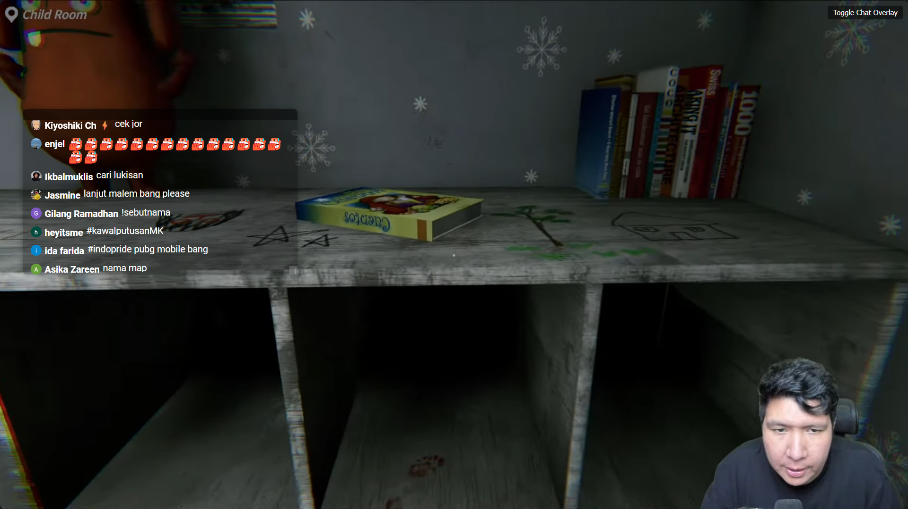

# YouTube Live Chat Overlay

The YouTube Live Chat Overlay is a browser extension that adds a customizable live chat overlay to YouTube videos in fullscreen mode. This allows you to view and interact with the live chat while watching the video in full-screen.

***

***

## Screenshot

## Features

- Displays live chat messages in a floating overlay on top of the YouTube video
- Allows you to drag and resize the overlay to your preferred position and size
- Automatically shows the overlay when entering fullscreen mode on a YouTube video

## Installation

### Firefox

Download the latest release of the extension from the [Firefox Add-ons website](https://addons.mozilla.org/en-US/firefox/addon/youtube-live-chat-overlay/).

## Usage

1. Navigate to a YouTube video or live stream.
2. Enter fullscreen mode by clicking the fullscreen button or pressing the F11 key.
3. The live chat overlay will automatically appear on the right side of the video.
4. Drag and resize the overlay to your preferred position and size using the provided handles.
5. To toggle the overlay, click the "Toggle Chat Overlay" button in the top-right corner of the video.

## Configuration

The extension's settings can be accessed by clicking the extension icon in your browser's toolbar and opening the popup window.

- **Enable Chat Overlay**: Toggle the live chat overlay on or off. When enabled, the overlay will appear in fullscreen mode.

## Limitations

- The extension only works on YouTube videos and live streams, not on other websites.
- The extension may not work with certain YouTube video players or layouts.
- The extension is not officially supported by YouTube and may stop working due to changes in the YouTube website.
