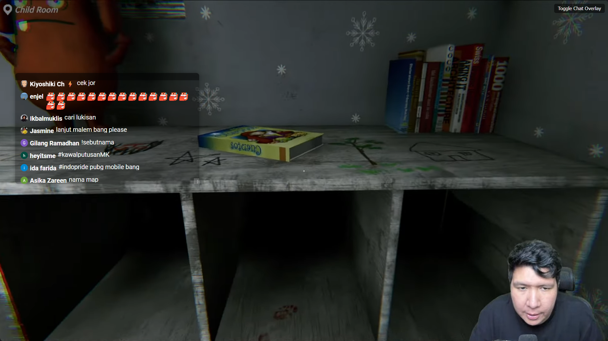

# YouTube Live Chat Overlay

YouTube Live Chat Overlay shows chat over fullscreen YouTube videos. Move, resize, and adjust the overlay to fit your screen.

***

***

## Screenshot

## Features

- Shows YouTube live chat in a floating overlay during fullscreen playback
- Lets you move, resize, and adjust the overlay
- Shows the overlay automatically when a YouTube video enters fullscreen

## Installation

### Firefox

Download the latest release of the extension from the [Firefox Add-ons website](https://addons.mozilla.org/en-US/firefox/addon/youtube-live-chat-overlay/).

## Usage

1. Navigate to a YouTube video or live stream.
2. Enter fullscreen mode by clicking the fullscreen button or pressing the F11 key.
3. The live chat overlay will automatically appear on the right side of the video.
4. Drag and resize the overlay to your preferred position and size using the provided handles.
5. Use the chat button on the video player to show or hide the overlay.

## Configuration

Click the gear icon on the overlay to adjust its appearance and choose which chat controls to show.

- **Chat opacity** and **Background blur**: Adjust the overlay's appearance.
- **Chat display**: Show the header on hover, hide the Super Chat ticker, or hide chat controls.

## Limitations

- The extension only works on YouTube videos and live streams, not on other websites.
- The extension may not work with certain YouTube video players or layouts.
- The extension is not officially supported by YouTube and may stop working due to changes in the YouTube website.
